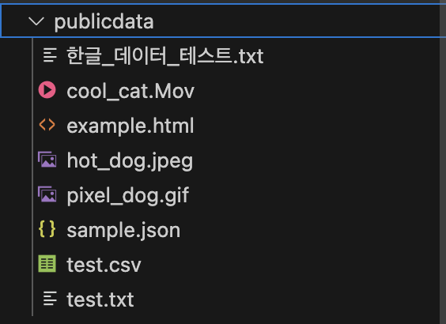

# 나비얌 챗봇 백엔드 작업 정리

## 프로젝트 개요
- **프로젝트명**: 나비얌 챗봇 (어린이를 위한 착한가게 추천 AI 챗봇)
- **담당 역할**: 백엔드 개발 (API 서버, 클라우드 인프라, 배포 자동화)
- **기술 스택**: Python, FastAPI, Google Cloud Platform, Docker

## 내가 실제로 수행한 작업

### 1. FastAPI 서버 개발

#### 1.1 메인 API 서버 (`server.py`)
- FastAPI 기반 REST API 서버 구축
- Google Cloud Storage 통합으로 파일 관리 시스템 구현
- HTTP Basic Authentication을 통한 보안 인증 구현
- 주요 엔드포인트:
  ```python
  - GET / : 서버 상태 및 서비스 정보
  - POST /send : 메시지 전송
  - POST /chat : 나비얌 챗봇과 대화
  - GET /health : 서비스 헬스체크
  - GET /files : GCS 파일 목록 조회 (인증 필요)
  - GET /files/{filename} : 특정 파일 다운로드
  - POST /uploadfile : 파일 업로드
  - GET /files_html : HTML 파일 뷰어
  - POST /data/add : 데이터 추가 (인증 필요)
  ```

#### 1.2 간단한 테스트 서버 (`main.py`)
- 초기 FastAPI 테스트용 서버
- 기본 REST API 엔드포인트 구현


### 2. Google Cloud Platform 인프라 구축

#### 2.1 GCP 리소스 설정
- **프로젝트 ID**: rational-autumn-467006-e2
- **리전**: asia-northeast3 (서울)
- **Cloud Storage 버킷**: rational-autumn-467006-e2-lsj-files

#### 2.2 Cloud Run 배포 설정
- 서버리스 컨테이너 배포
- 자동 스케일링 설정 (0~10 인스턴스)
- 메모리: 2Gi, CPU: 1 core
- 동시 처리: 80 요청
- 타임아웃: 300초

#### 2.3 Artifact Registry
- Docker 이미지 저장소 구성
- 리포지토리: naviyam-repo
- 이미지 태깅 전략: latest 및 BUILD_ID

### 3. Docker 컨테이너화

#### 3.1 Dockerfile 작성
```dockerfile
- 베이스 이미지: python:3.9-slim-buster
- 작업 디렉토리: /app
- 포트: 8080
- 실행 명령: uvicorn server:app --host 0.0.0.0 --port 8080
```


#### 3.2 requirements.txt 관리
```python
- fastapi : 웹 프레임워크
- uvicorn[standard] : ASGI 서버
- pandas : 데이터 처리
- google-cloud-storage : GCS 연동
- aiofiles : 비동기 파일 처리
- python-multipart : 파일 업로드
- pytest, httpx : 테스팅
```

### 4. CI/CD 파이프라인 구축

#### 4.1 Cloud Build 설정 (`cloudbuild.yaml`)
- Docker 이미지 자동 빌드
- Artifact Registry 푸시
- Cloud Run 자동 배포
- 환경변수 설정 (USERNAME, PASSWORD, GCS_BUCKET_NAME)
- 빌드 머신: E2_HIGHCPU_8
- 타임아웃: 1200초


### 5. 테스트 및 검증

#### 5.1 유닛 테스트 (`test_server.py`)
- FastAPI TestClient를 활용한 API 테스트
- 인증 테스트 (authorized/unauthorized)
- 파일 작업 테스트
- 엔드포인트 응답 검증


### 6. 파일 관리 시스템

#### 6.1 Google Cloud Storage 통합
- 파일 업로드/다운로드 API
- 파일 목록 조회
- 인증 기반 접근 제어
- 다양한 파일 타입 지원 (이미지, 텍스트, JSON, 비디오)

#### 6.2 정적 파일 서빙
- publicdata 디렉토리 관리
- 샘플 파일 제공 (cool_cat.Mov, hot_dog.jpeg, pixel_dog.gif 등)
- 한글 파일명 지원



### 7. 보안 구현

#### 7.1 인증 시스템
- HTTP Basic Authentication
- 환경변수를 통한 자격증명 관리
- secrets.compare_digest를 사용한 안전한 비밀번호 검증

#### 7.2 CORS 설정
- 크로스 오리진 요청 처리
- 프로덕션 환경을 위한 설정 준비

### 8. API 문서화

#### 8.1 FastAPI 자동 문서화 기능 이용
- Swagger UI (/docs)
- ReDoc (/redoc)
- API 명세 자동 생성

#### 8.2 응답 모델 정의
- Pydantic 모델 활용
- ChatRequest/ChatResponse 모델
- 타입 안정성 보장


## 주요 성과

1. **서버리스 아키텍처**: Cloud Run을 활용한 비용 효율적인 운영
2. **자동화된 배포**: Cloud Build를 통한 CI/CD 파이프라인 구축
3. **확장 가능한 설계**: 모듈화된 코드 구조로 기능 추가 용이
4. **안정적인 파일 관리**: GCS 통합으로 대용량 파일 처리 가능
5. **테스트 커버리지**: 유닛 테스트 및 통합 테스트 구현

## 배포된 서비스

현재 재배포 중

## 프로젝트 구조
```
/Volumes/samsd/skt_teamproject/
├── server.py              # 메인 API 서버
├── main.py               # 테스트용 간단한 서버
├── test_server.py        # 유닛 테스트
├── test_integration.sh   # 통합 테스트 스크립트
├── Dockerfile           # Docker 컨테이너 설정
├── cloudbuild.yaml      # Cloud Build 설정
├── requirements.txt     # Python 의존성
└── publicdata/         # 정적 파일 디렉토리
```

## 향후 개선 계획

1. **API Gateway 도입**: 더 나은 API 관리 및 모니터링
2. **캐싱 전략**: Redis를 활용한 응답 캐싱
3. **로깅 시스템**: Cloud Logging과 통합된 중앙화된 로깅
4. **모니터링 대시보드**: Cloud Monitoring을 활용한 실시간 모니터링
5. **부하 테스트**: Locust를 활용한 성능 테스트 및 최적화
6. **실제작동하는챗봇** 과 어플 결합
7. **어플** 업데이트 및 재배포 자동화
8. **챗봇** 업데이트 및 재배포 자동화